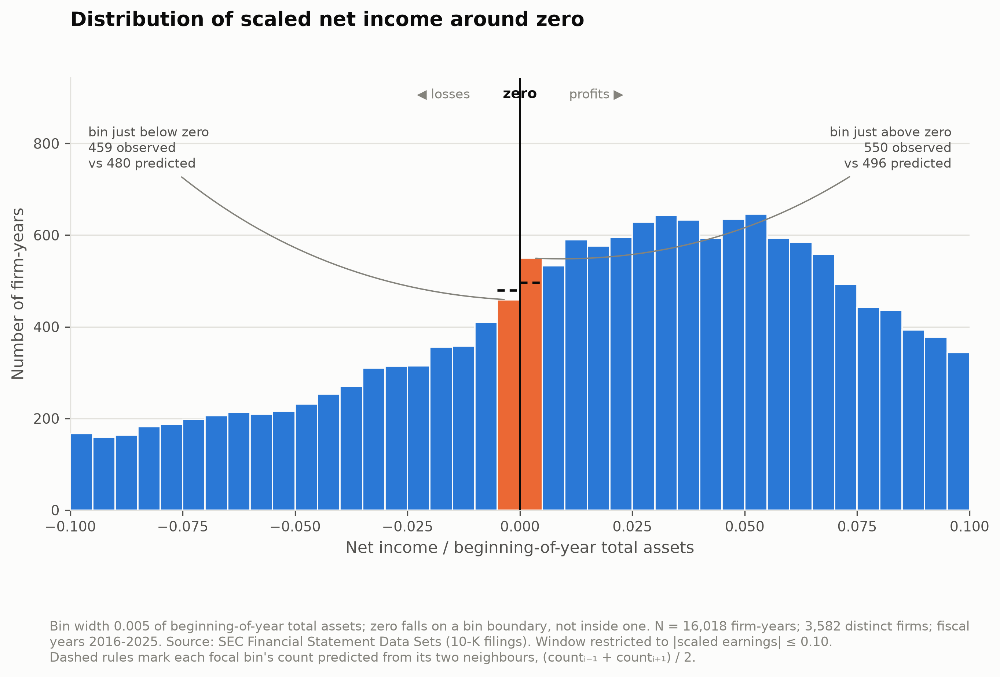
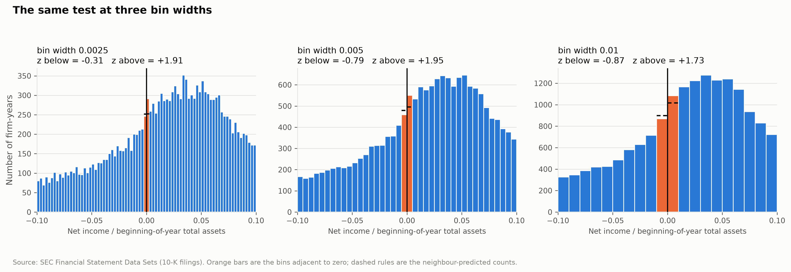
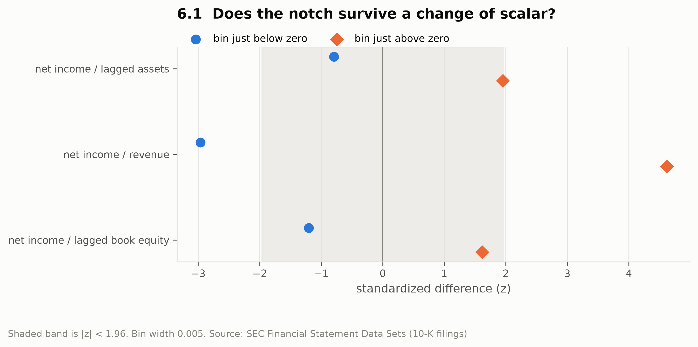
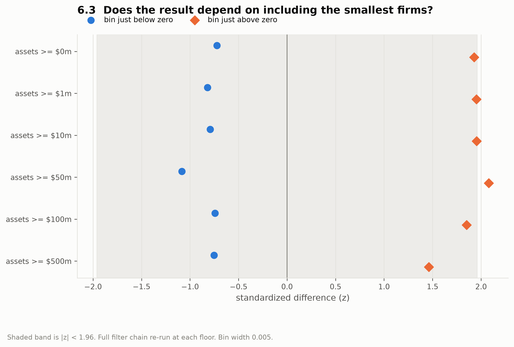
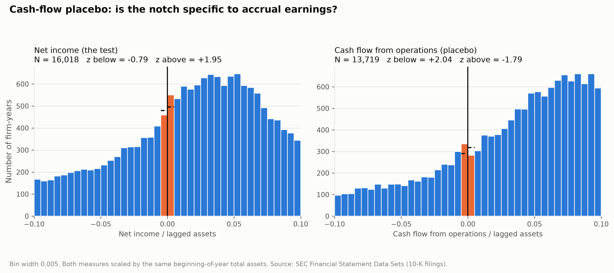

# Do companies bend earnings to avoid reporting a loss?

A test of whether the cross-firm distribution of scaled net income shows an unnatural
discontinuity at zero — too few small losses, too many small profits — and whether
that gap survives robustness checks.

**Headline result: no clear discontinuity.** In 16,018 firm-years of recent SEC filing
data, the bin immediately below zero is smaller than its neighbours predict at every
bin width tested, but never significantly so. The surplus immediately above zero is
marginal (p ≈ 0.05–0.08). The result is strongly dependent on the choice of scaling
denominator, and a cash-flow placebo — a measure that should be much harder to manage
— shows a *larger and opposite-signed* break at the same point. Read as a measurement
study, this sample does not provide evidence of earnings management at the zero
threshold; it provides a fairly clean demonstration of why the classical finding is
contested.



---

## 1. The question

If reported earnings were unmanaged, the distribution of net income across thousands
of firms should be smooth. There is no economic reason for a sharp break at exactly
zero. But managers near a small loss have discretion — timing a write-off,
recognising revenue slightly early, adjusting a reserve estimate. If that discretion
is used to cross zero, the distribution should show a **notch**: a deficit of firms
just below zero and a surplus just above.

- **H1** — the observed frequency in the bin immediately below zero is lower than
  neighbouring bins predict.
- **H0** — the distribution is smooth through zero; any apparent notch is sampling
  variation.

## 2. Background

Two papers frame the project. Both citations were verified against the publishers'
records rather than quoted from memory.

- Burgstahler, D., & Dichev, I. (1997). "Earnings management to avoid earnings
  decreases and losses." *Journal of Accounting and Economics*, 24(1), 99–126.
  The original finding — this is what is being replicated.
- Durtschi, C., & Easton, P. (2005). "Earnings Management? The Shapes of the
  Frequency Distributions of Earnings Metrics Are Not Evidence Ipso Facto."
  *Journal of Accounting Research*, 43(4), 557–592. The critique: a discontinuity can
  arise from **scaling and sample-selection artifacts** rather than manipulation.

The four robustness checks in section 6 exist specifically to address the critique.
(Durtschi and Easton returned to the argument at greater length in *Journal of
Accounting Research* in 2009, "Earnings Management? Erroneous Inferences Based on
Earnings Frequency Distributions"; page numbers for that follow-up were not
independently verified and it is not relied on here.)

## 3. Data

**Headline source — SEC Financial Statement Data Sets.** Quarterly flat files derived
from XBRL filings, no authentication required:

```
https://www.sec.gov/files/dera/data/financial-statement-data-sets/{YYYY}q{Q}.zip
```

Schema was verified against the live 2026q1 archive before the loader was written
(the format has changed over the years). `num.txt` currently carries
`adsh tag version ddate qtrs uom segments coreg value footnote`; `qtrs = 0` marks a
point-in-time balance-sheet value and `qtrs = 4` a full annual period. Only rows with
blank `segments` and blank `coreg` are kept, so every figure is a consolidated total
rather than a segment breakdown.

37 quarterly archives were processed (2017q1–2026q1), scanning **113,203,537** fact
rows with zero malformed lines.

**Only 10-K submissions are used.** A 10-K carries the comparative balance sheet, so a
single filing supplies both current-year and prior-year total assets. That is where
the lagged denominator comes from — no cross-filing join, and the prior-year figure is
the one the filer itself presents as the comparative.

**Prototype source — `yfinance`.** 300 tickers drawn at random (seed 42) from EDGAR's
ticker universe, used for the Phase 0 crude look and for the one robustness check the
SEC files cannot support (market value of equity). Thin and survivorship-biased; it is
a sanity check, not a result.

### Sample filters and the full exclusion log

Filters were fixed before any result was inspected. Every exclusion is counted.

| Filter | Dropped | Remaining rows | Remaining firms |
|---|---:|---:|---:|
| 0. raw 10-K firm-years | 0 | 57,407 | 10,304 |
| 1. restrict to fiscal years 2016–2025 | 141 | 57,266 | 10,276 |
| 2. drop missing SIC | 550 | 56,716 | 10,078 |
| 3. drop financial firms (SIC 6000–6999) | 14,590 | 42,126 | 7,251 |
| 4. drop utilities (SIC 4900–4949) | 1,404 | 40,722 | 7,034 |
| 5. drop missing net income | 703 | 40,019 | 6,979 |
| 6. drop missing or non-positive lagged total assets | 764 | 39,255 | 6,882 |
| 7. size floor: lagged assets ≥ $10m | 8,011 | 31,244 | 5,366 |
| 8. one filing per firm-fiscal-year | 4 | **31,240** | **5,366** |

Rationales, in the same order:

1. **Fiscal-year range** — only 2016–2025 are fully covered by the downloaded filing
   quarters. Stragglers outside the range are delinquent filers representing a handful
   of firms, not a usable cross-section.
2. **Missing SIC** — the industry filters below cannot be applied without an industry code.
3. **Financial firms** — bank and insurer balance sheets are structurally different;
   total assets does not mean the same thing, so scaling by it is not comparable.
4. **Utilities** — rate-regulated returns make utility earnings mechanically smooth
   near a target. Conventional in this literature; optional, and applied here.
5. **Missing net income** — no numerator, no observation.
6. **Missing or non-positive lagged assets** — the denominator must exist and be
   positive; a non-positive denominator flips the sign of the scaled measure.
7. **Size floor** — tiny denominators produce extreme scaled values and are the known
   source of the artifact Durtschi and Easton identify. Sensitivity to the floor is
   reported in check 6.3 and the result does not depend on it.
8. **One filing per firm-year** — amended and transition-period filings can duplicate
   a firm-year; the most recent period end is kept.

Applying the analysis window |ROA| ≤ 0.10 then leaves **16,018 firm-years across
3,582 firms**; 15,222 firm-years fall outside the window and are not part of the test.

**Pooling.** Multiple years per firm are kept (mean 5.8 years per firm). This inflates
N relative to the number of independent units, so the reported p-values overstate
precision somewhat. Pooling is the simplest defensible choice and is stated rather
than hidden.

## 4. Variable construction

```
ROA_it = NetIncome_it / TotalAssets_i,t-1
```

**Beginning-of-year assets, always.** End-of-year assets already reflect the current
year's earnings, which would put the thing being measured into the denominator. The
two differ in essentially every firm-year in this panel; notebook 01 shows the check.

## 5. Method

For each bin, the count is predicted from its immediate neighbours:

```
expected_i = (count_{i-1} + count_{i+1}) / 2
```

Under a smoothness null the difference is approximately normal, with a standard
deviation from the binomial argument standard in this literature:

```
sd_i = sqrt( N·p_i·(1-p_i) + ¼·N·(p_{i-1}+p_{i+1})·(1 - p_{i-1} - p_{i+1}) )
```

Three commitments, made before looking at output and enforced in code:

- **Zero sits on a bin boundary**, never inside a bin. Every bin edge is an integer
  multiple of the bin width, so this holds by construction; `tests/test_binning.py`
  enforces it.
- **All three bin widths reported** — 0.0025, 0.005, 0.01. A result appearing at only
  one width is not a result.
- **Both sides reported** — the bin immediately below zero *and* the bin immediately
  above. The hypothesis predicts a deficit below and a surplus above; finding only one
  is weaker evidence and is said so.

Two goodness-of-fit statistics accompany the z-tests: the neighbour-average
chi-square from the spec (approximate degrees of freedom, since the expectation is
data-derived) and a complementary version that fits a smooth polynomial to the window
with the two zero-adjacent bins **held out**, so its 2 df are interpretable normally.

## 6. Results

### Main test — net income scaled by beginning-of-year total assets

N = 16,018 firm-years.

| Bin width | Below zero (obs / pred) | z | p | Above zero (obs / pred) | z | p |
|---|---|---:|---:|---|---:|---:|
| 0.0025 | 246 / 252.0 | −0.31 | 0.75 | 291 / 252.5 | +1.91 | 0.057 |
| 0.005 | 459 / 479.5 | −0.79 | 0.43 | 550 / 496.0 | +1.95 | 0.051 |
| 0.01 | 868 / 898.5 | −0.87 | 0.38 | 1,083 / 1,017.0 | +1.73 | 0.083 |

The held-out-bin chi-square rejects smoothness at all three widths (p = 0.0009,
0.0052, 0.0044), but the rejection is driven almost entirely by the surplus *above*
zero, not by a deficit below it.

**Reading:** the sign is the predicted one at every width — fewer small losses than
neighbours imply, more small profits — so the direction is consistent with earnings
management. But the deficit below zero is nowhere close to significant, and the
surplus above zero sits at the 0.05 boundary. On its own this is a weak positive at
best.



### 6.1 Alternate denominators

| Denominator | N | z below | p | z above | p |
|---|---:|---:|---:|---:|---:|
| lagged total assets | 16,018 | −0.79 | 0.43 | +1.95 | 0.051 |
| revenue | 13,452 | **−2.97** | **0.003** | **+4.62** | **<0.001** |
| lagged book equity | 7,177 | −1.20 | 0.23 | +1.61 | 0.11 |

*(bin width 0.005; revenue holds at all three widths, z below = −3.31 / −2.97 / −3.25)*

The result **is denominator-dependent**. Scaling by revenue produces a clear,
significant notch in both directions at every bin width; scaling by assets or book
equity does not. This is precisely the sensitivity Durtschi and Easton warned about,
and it is the single most important finding in this project.

**Market value of equity** is not available in the SEC flat files — they carry no
price data. It was tested instead on the yfinance sample (N = 237), which is far too
small to be informative (z below = −1.75 / +0.19 / −0.97). This substitution is a
documented deviation from the original plan, not a silent omission.



### 6.2 Size terciles

| Tercile | Median lagged assets | N | z below | z above |
|---|---:|---:|---:|---:|
| small | $196m | 5,340 | −0.25 | +1.38 |
| medium | $1,549m | 5,339 | −0.26 | +1.23 |
| large | $9,578m | 5,339 | −0.91 | +0.73 |

No concentration in small firms. The artifact story predicts the notch should be
strongest among small firms; it is not. That mildly *disfavours* the small-firm
scaling explanation — though with nothing significant in any tercile, this check
distinguishes little.

### 6.3 Size-floor sensitivity

| Floor on lagged assets | Panel N | Window N | z below | z above |
|---|---:|---:|---:|---:|
| $0 | 39,242 | 16,480 | −0.72 | +1.93 |
| $1m | 34,941 | 16,386 | −0.82 | +1.95 |
| $10m (headline) | 31,240 | 16,018 | −0.79 | +1.95 |
| $50m | 26,315 | 14,929 | −1.09 | +2.08 |
| $100m | 23,782 | 14,193 | −0.74 | +1.85 |
| $500m | 16,572 | 11,384 | −0.75 | +1.46 |

Stable. The result does not depend on including or excluding the smallest firms, so
the headline $10m floor is not doing any work.



### 6.4 Cash-flow placebo — the decisive check

The identical test on cash flow from operations, scaled by the **same**
beginning-of-year total assets. CFO is much harder to shift across zero through
accrual timing.

| Measure | Bin width | z below | p | z above | p |
|---|---:|---:|---:|---:|---:|
| net income | 0.0025 | −0.31 | 0.75 | +1.91 | 0.057 |
| net income | 0.005 | −0.79 | 0.43 | +1.95 | 0.051 |
| net income | 0.01 | −0.87 | 0.38 | +1.73 | 0.083 |
| cash flow from ops | 0.0025 | +0.45 | 0.65 | −0.58 | 0.56 |
| cash flow from ops | 0.005 | **+2.04** | **0.042** | −1.79 | 0.074 |
| cash flow from ops | 0.01 | **+3.55** | **<0.001** | **−3.59** | **<0.001** |

CFO shows a break at zero that is **larger and opposite in sign** to the one in net
income: a *surplus* just below zero and a *deficit* just above.

This does not support the "common scaling artifact" story in its simple form — a
shared artifact would push both measures the same way. What it does show is that the
local-smoothness null fails badly for a measure that is hard to manage through
accruals, which means a marginal z-statistic in net income cannot bear much weight.
The magnitude also grows with bin width (+0.45 → +2.04 → +3.55), the signature of
local curvature in the density being mistaken for a discontinuity rather than of a
knife-edge break at zero.



## 7. What this does and does not show

**Does:** in this sample, the distribution of net income scaled by lagged total assets
is *slightly* thinner just below zero and thicker just above than a neighbour-average
smoothness null predicts, at every bin width tested. That pattern is **consistent with
earnings management** to avoid reporting a loss. It is also consistent with several
other things.

**Does not:** this is a distributional anomaly, not a causal finding. Nothing here
identifies a manager, a decision, or an accrual. The test cannot distinguish
management from any other mechanism that puts extra mass just above zero.

**Bottom line.** I did not find statistically significant evidence of a deficit of
small losses in recent SEC filing data. The one clearly significant version of the
result appears only under revenue scaling, and the cash-flow placebo shows the
smoothness null failing on its own terms. Reported as a measurement study, the
contribution is showing how much the classical result depends on choices — of
scalar above all — that are usually made in passing.

## 8. Limitations

- **Pooled firm-years.** 5.8 years per firm on average; observations within a firm are
  not independent, so p-values are optimistic.
- **The smoothness null is the weak link.** The placebo shows neighbour-averaging
  produces significant "discontinuities" in data that should not have one. A stronger
  design would model the density explicitly rather than assume local linearity.
- **Recent period only.** Fiscal years 2016–2025. The classical result was documented
  on 1976–1994 data; if the notch has genuinely faded post-SOX, a null here is
  consistent with the original finding rather than a contradiction of it. This project
  does not test that — a time-trend split was deliberately left out of scope.
- **Survivorship and coverage.** XBRL-era filers only; firms that deregistered before
  2017 never appear. Revenue is tagged inconsistently across filers, so the
  revenue-scaled sample is a somewhat different set of firms than the asset-scaled one.
- **Market value of equity untested at scale.** See 6.1.
- **10-K only.** Amended filings (10-K/A) are excluded rather than merged.

## 9. Repository layout

```
data/          panel.parquet (cached clean panel), drop_log.csv, result tables
               raw_sec/ and cache/ are gitignored -- rebuilt by src/sec_loader.py
notebooks/     01_explore, 02_main_test, 03_robustness -- run top-to-bottom on the cache
figures/       headline_histogram.png (+ .svg) and all robustness figures
src/           sec_loader, yf_loader, panel, binning, discontinuity, plotting, build_panel
tests/         35 unit tests -- lag logic, zero-on-boundary, drop-log accounting, notch detection
writeup/       2-3 page writeup
slides/        slides.html -- 8-slide deck
```

## 10. Reproducing

```bash
python3 -m venv .venv && source .venv/bin/activate
pip install -r requirements.txt

# one-time: download and reduce 37 SEC quarterly archives (~2 GB, ~15 min)
python src/sec_loader.py --start 2017q1 --end 2026q1

# optional: the Phase 0 prototype pull
python src/yf_loader.py --draw 800 --target 300 --seed 42

# build the cached panels and the exclusion logs
python -m src.build_panel

# tests
pytest tests/ -q

# notebooks -- these read the parquet cache and download nothing
jupyter nbconvert --to notebook --execute --inplace notebooks/*.ipynb
```

Raw SEC archives are never committed. Seeds are fixed (`42` for the ticker draw,
`20250811` in the notebooks). Package versions are pinned in `requirements.txt`.

## References

- Burgstahler, D., & Dichev, I. (1997). Earnings management to avoid earnings
  decreases and losses. *Journal of Accounting and Economics*, 24(1), 99–126.
- Durtschi, C., & Easton, P. (2005). Earnings Management? The Shapes of the Frequency
  Distributions of Earnings Metrics Are Not Evidence Ipso Facto. *Journal of
  Accounting Research*, 43(4), 557–592.
- U.S. Securities and Exchange Commission, Financial Statement Data Sets.
  https://www.sec.gov/data-research/sec-markets-data/financial-statement-data-sets
